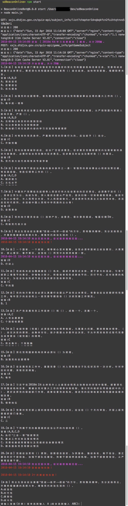
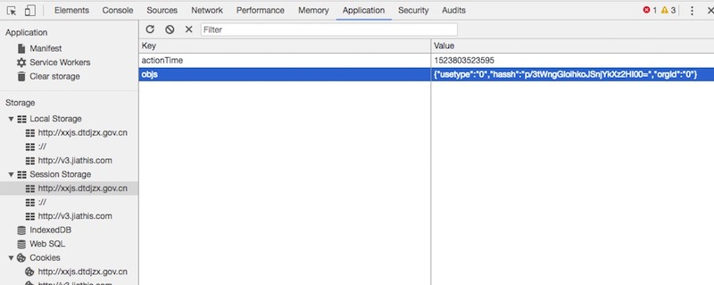

## 灯塔在线答题半自动机器人
- 基于灯塔的Web版本
- 环境: node

> 鉴于个人能力有限, 不懂各种复杂的模糊匹配算法, 目前答案检索成功率并不是100%, 检索失败的题目还需要人工输入答案...

# 运行示例


# How to start
## 准备
安装依赖库
```
npm install
```
测试
```
npm test
```

## 登录
修改配置文件`login.json` 
修改 hassh 字段
如果是qunzhong, 则为个人的手机号;
如果是dangyuan, 则为登录后的token;

token查看方式, 用chrome登录灯塔在线, 然后打开chrome的调试页面



## 启动
```
npm start
```

## Project目录说明
* ./analytics 目录下有各个接口返回的json数据和官方js文件;
* ./train_data 目录下缓存每次拉取到的试题,方便后续测试;


## TODO 
1. 模糊匹配算法, 提高检索成功率;
2. 实现登录功能;

## 声明
此project仅为个人学习node.js所用,若用于他用,后果请自负...