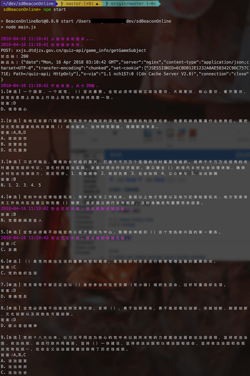
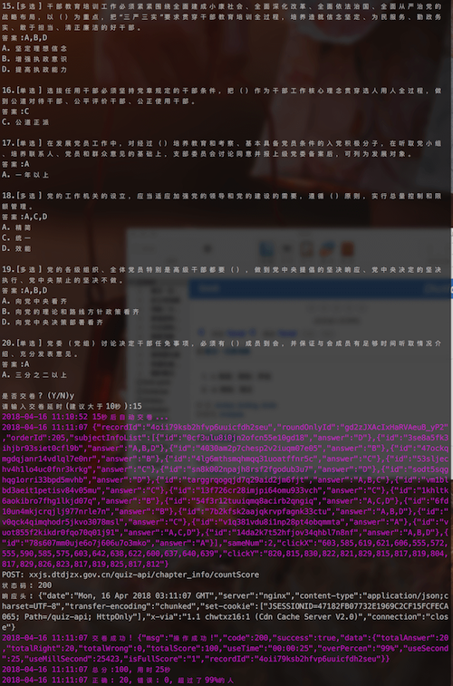

## sdBeaconOnline 半自动答题机器人
一键 登录 + 更新题库 + 获取试题 + 自动答题 + 交卷

[给普通用户的使用说明](https://www.jianshu.com/p/2f32b76b9bf4)

## 声明
此project仅为个人学习node.js所用,若用于他用,后果请自负...

- 基于dengta的Web版本
- 环境: node

> 鉴于个人能力有限, 不懂各种复杂的模糊匹配算法, 目前答案检索成功率并不是100%, 检索失败的题目还需要人工输入答案...

# 运行示例


# How to start
## 准备
安装依赖库
```
npm install
```
测试
```
npm test
```


## 启动
```
npm start
```

## Project目录说明
* ./analytics 目录下有各个接口返回的json数据和官方js文件;
* ./train_data 目录下缓存每次拉取到的试题,方便后续测试;


## TODO 
1. 模糊匹配算法, 提高检索成功率;


## 关于
---

冒天下之大不韪写了这么个东西, 难道不该请俺喝杯咖啡嘛 ^_^

|  |  |
| :-:   | :-: |
| 微信赞赏 | 支付宝 |
